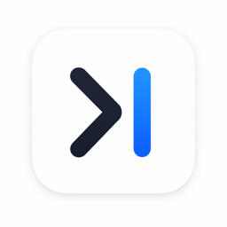

<p align="center">
  
</p>

<h1 align="center">DevBar</h1>

<p align="center">
  A macOS menu-bar launcher for your local development services.<br/>
  Start &amp; stop commands, switch git branches per group, run actions, watch logs &mdash; all from the menu bar.
</p>

---

## Features

- **Groups of commands** — bundle every `pnpm start:*` of a monorepo under one group sharing the same `cwd` and git repo.
- **Single or multi run mode** — pick one command at a time, or start several in parallel.
- **One-shot actions** — fire-and-forget commands per group (`pnpm install`, run tests, etc.).
- **Icon battery** — pick from 115 curated emojis to tell groups, commands and actions apart at a glance.
- **Live status colors** — a dot tinted green / yellow / red follows each command's stdout for warns and errors.
- **Live uptime** — see how long each command has been running, right inside the popover and the logs window.
- **Searchable branch combobox** — type to filter, ✓ marks the current branch.
- **Native folder picker** for paths, native save / open dialogs for full config JSON import / export.
- **Dynamic env editor** with per-entry on/off, a master "enable all" switch, group-level env, and an opt-in `Heredar variables del grupo` toggle for actions.
- **Native macOS chrome** — `hiddenInset` titlebars, vibrancy, fake traffic lights inside modal dialogs, dark-mode aware.

## Run in dev

```bash
npm install
npm start
```

A status icon (the same one shown above) appears on the right side of the menu bar:

- gray dot — all services stopped
- green — running, 0 warns / 0 errors
- yellow — at least one warning detected in stdout/stderr
- red — at least one error detected, or a process died

Click the icon to open the popover. Click **Configuración** to add and edit groups.

## Build a `.app`

```bash
npm run pack
```

The bundle ends up in `dist/DevBar-darwin-*`. The icon comes from
`assets/icon.icns` (multi-resolution 16 → 1024).

## Install / reinstall to `/Applications`

```bash
npm run install-local
```

Stops any running DevBar (packaged or `npm start`), repacks, replaces
`/Applications/DevBar.app`, strips the Gatekeeper quarantine flag (the
bundle is unsigned), and relaunches. Falls back to `~/Applications` if
`/Applications` is not writable.

## Tests

```bash
npm test
```

Vitest covers the pure modules (`groups-model`, `compound-id`,
`parse-command`, `path-helper`, `format-uptime`, `config-io`).

## Where is the config?

`~/Library/Application Support/devbar/config.json`

You can also export it to JSON or import another machine's config from
**Configuración → Copia de seguridad**.
